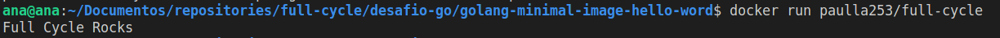
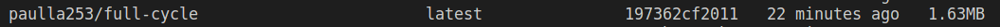

# Desafio Full Cycle:

1. Você terá que publicar uma imagem no docker hub.

https://hub.docker.com/repository/docker/paulla253/full-cycle/general

2. Temos que ter o seguinte resultado: Full Cycle Rocks!!
   
3. A imagem de nosso projeto Go precisa ter menos de 2MB:

